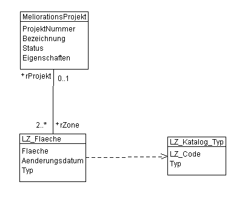

# Dokumentation zum Workshop 2: _Fortgeschrittene Datenvalidierung mittels ilivalidator und Validierungsmodellen/Konsistenzbedingungen_

22.11.2023, oliver.grimm@geowerkstatt.ch

## Ziel & Übersicht

Dieser Workshop zeigt im Rahmen einer Einführung die Implementierung von einem halben Dutzend fiktiver Konsistenzbedingungen (Constraints) zum Schulungsmodell *LWB_Landwirtschaftliche_Zonengrenzen_V2_0_ILI24*.

Anhand dieses Beispiels werden sowohl verschiedene Constraint-Typen wie auch verschiedene Implementierungsvarianten gezeigt.
Diese Constraint-Typen prüfen Bedingungen in bezug auf den Hauptdatensatz sowie auf die Katalog-Referenzen und nutzen unterschiedliche Funktionen aus den Funktionsbibliotheken Text (https://www.interlis.ch/download/interlis2/Text_d.pdf) sowie die Open-Source-Bibliothek von GeoWerkstatt (https://github.com/GeoWerkstatt/geow-interlis-functions).

Ausgangslage bildet das INTERLIS 2.4-Modell *LWB_Landwirtschaftliche_Zonengrenzen_V2_0_ILI24* mit dem dazugehöroigen Katalogmodell *LWB_Landwirtschaftliche_Zonengrenzen_Kataloge_V2_0_ILI24*:



## Ausgangslage

Die Workshop-Dateien liegen in den Verzeichnissen ``\model`` und ``\data``:

Verzeichnis | Datei    | Zweck
----------- | -------- | --------
\\.   | addchecks.ini   | Konfigurations-Datei für die Angabe des Validierungsmodells oder weiteren Parameters zur Steuerung der Validierung (Thema Workshop#1)
.\model   | LWB_Landwirtschaftliche_Zonengrenzen_V2_0_ILI24.ili   | INTERLIS 2.4-Datei der Schulungsmodelle
.\model         | Text.ili   | Funktionsmodell zu den TEXT-Funktionen gemäss https://www.interlis.ch/download/interlis2/Text_d.pdf
.\model          | GeoW_Functions.ili   | Funktionsmodell zu den Funktionen gemäss https://github.com/GeoWerkstatt/geow-interlis-functions 
.\model          | LWB_Landwirtschaftliche_Zonengrenzen_V2_0_ILI24_AddChecks.ili   | Validierungsmodell 
.\data          | LWB_Landwirtschaftliche_Zonengrenzen_Testdata_ILI24.xtf   | Geodatensatz (INTERLIS 2.4, reduziert auf 100 Objekte, Quelle: https://data.geo.admin.ch/browser/index.html#/collections/ch.blw.landwirtschaftliche-zonengrenzen?.language=en)
.\data          | LWB_Landwirtschaftliche_Zonengrenzen_Kataloge_V2_0_ILI24.xml   | Katalog der Zonen-Typen (INTERLIS 2.4)
.\model\\_solution          | div   | Lösungsdateien

Hinweis: Sowohl die Schulungsdaten wie auch die dazugehörigen Modelle wurden für diesen Workshop erweitert bzw. manipuliert und sind ausschliesslich für diesen Zweck bestimmt.

## Anforderungen ans System

Empfohlene Arbeitsumgebung:

Zweck | Tool
----------- | -------- 
Editierung ILI-Dateien   | Visual Studio Code (inkl. INTERLIS2 Extension)
Kompilierung der Modelle | ili2c: https://jars.interlis.ch/ch/interlis/ili2c-tool/5.4.0-SNAPSHOT/ili2c-tool-5.4.0-20231114.144727-1-bindist.zip
Validierung der Daten | ilivalidator: https://jars.interlis.ch/ch/interlis/ilivalidator/1.14.0-SNAPSHOT/ilivalidator-1.14.0-20231115.154347-1-bindist.zip
ilivalidator-Plugin| ilivalidator-Plugin https://github.com/GeoWerkstatt/geow-interlis-functions/releases/download/v0.1.10-SNAPSHOT-6322526844/geow-interlis-functions-0.1.10-SNAPSHOT.jar (-> muss ins Verzeichnis ilivalidator\plugins kopiert werden)

## Anforderungen an die INTERLIS-Kenntnisse

Das Schulungsmodell ist mit 2 Klassen und einer Beziehung simpel aufgebaut. Für das Verständnis der Konsistenzbedingungen ist neben INTERLIS-Basis-Wissen grundsätzliches Verständnis zu externen Katalogen und Ausdrücken förderlich.

## Los gehts!

### Hinweis

Dieser Workshop verzichtet ausdrücklich auf einen einleitenden Theorie-Teil. Die Idee ist, dass zusammen mit der Implementierung der unterschiedlichen Konsistenzbedingungen auf die entsprechenden Konzepte und Zusammenhänge eingegangen wird.
Dementsprechend sind die folgenden Beispiel bezüglich der Komplexität stetig zunehmend (und die Erläuterungen entsprechend immer länger).
Die Beispiele basieren alle auf der Sprachversion 2.4. Für eine Kompatibilität mit 2.3 ist grundsätzlich auf die Benennung des Constraints zu verzichten und das entsprechende Tag im Titel zu beachten.

---

### Bedingung#1: Erwartetes Projekt-Nummer-Muster 

*Ziel: Die Projektnummern in der Klasse MeliorationsProjekt soll formal einem spezifischen Muster entsprechen. So sollen Nummern erkannt werden, welche nicht dem beispielhaften Schema 6554-JU entsprechen.*

Diese Umsetzung erfolgt direkt auf dem bestehenden DOMAIN-Eintrag *ProjektID* mittels dem Schlüsselwort CONSTRAINTS, dem Namen der Bedingung und der dahinter folgenden Bedingung:

```
DOMAIN
ProjektID = TEXT*7 CONSTRAINTS CheckProjNr : Text.matches(THIS, "^[0-9]{4}-[A-Z]{2}$");
```

Erläuterung:

* ``CheckProjNr`` : Namen des Constraints (unterstützt die Identifizierung in der Log-Datei)

* ``Text.matches()`` : Funktion zum Vergleich des Attributwertes gegenüber einer Regular Expression. Doku unter: https://www.interlis.ch/download/interlis2/Text_d.pdf

* ``(THIS, "^[0-9]{4}-[A-Z]{2}$")`` : Parameter der Funktion: ``THIS`` liefert den jeweiligen Attributwert, ``^[0-9]{4}-[A-Z]{2}$`` beschreibt die Regular Expression welche das erwartete Zeichen-Muster spezifiziert und übersetzt etwa so viel heisst: *Die Zeichenfolge beginnt mit (genau) 4 Zahlen, gefolgt von einem Bindestrich und endet mit (genau) zwei Grossbuchstaben.*

Validierung der XTF-Datei:

```java -jar ilivalidator-1.14.0-SNAPSHOT.jar  --allObjectsAccessible --trace --modeldir ".\model\;https://models.interlis.ch" .\data\LWB_Landwirtschaftliche_Zonengrenzen_Testdata_ILI24.xtf .\data\LWB_Landwirtschaftliche_Zonengrenzen_Kataloge_V2_0_ILI24.xml```

Spezialitäten:

* XTF- und XML-Datei (Katalog) werden mitgegeben.

* ``--allObjectsAccessible`` prüft alle möglichen Referenzen in der Transferdatei (auch jene zum Katalog)

* ``--modeldir`` enthält den Pfad zum lokalen Modell-Archiv (da die entsprechenden 2.4-Modellversionen noch nicht öffentlich publiziert sind)

* ``--trace`` gibt uns eine erweiterte Logausgabe

---

### Bedingung#2: MANDATORY unter gewissen Umständen 

*Ziel: In der Klasse MeliorationsProjekt ist das Attribut per default optional, soll aber unter gewissen Umständen zwingend abgefüllt sein.*

Diese Umsetzung erfolgt als MANDATORY CONSTRAINT zu unterst in der Klasse MeliorationsProjekt. Der Constraint-Typ MANDATORY bedeutet, dass jeder einzelne Datensatz dieser Prüfung unterzogen wird. Wir lernen in der Folge dann noch weitere Typen kennen. Für diese Konsistenzbedingung setzen wir die Implikation aus, was in einem doch sehr schön lesbaren Constraint endet:

```
MANDATORY CONSTRAINT CheckBezeichnung : Status == #abgeschlossen => DEFINED(Bezeichnung);
```

Erläuterung:

* ``CheckBezeichnung`` : Namen des Constraints (unterstützt die Identifizierung in der Log-Datei)

* ``Status == #abgeschlossen`` : Vorbedingung: filtert das zu prüfende Objekt (hier eine Aufzählung, darum mit #) im Sinne "wenn der Status gleich abgeschlossen ist, dann..."

* ``=> DEFINED(Bezeichnung)`` : Nachbedingung: prüft sofern die Vorbedingung erfüllt ist. In diesem Beispiel mittels dem Prädikat DEFINED(), welches Wahr retourniert, falls ein Wert im Attribut Bezeichnung vorhanden ist.

---

### Bedingung#3: Plausibilität's-Prüfung auf die Datumswerte  

*Ziel: Es soll geprüft werden, dass nicht mehr als 2% der Datensätze ein Änderungsdatum vor dem 31.12.2015 haben.*

Diese Umsetzung erfolgt mit einem sog. Plausibilitäts-Constraint. Dieser wirkt im Gegensatz zu seinen beiden Vorgängern nicht auf einen einzelnen Datensatz, sondern zieht das gesamte Set zur Validierung bei.

```
CONSTRAINT CheckDatum: <=2 % Aenderungsdatum >= "2016-01-01" ; 
```

Erläuterung:

* ``CheckDatum`` : Namen des Constraints (unterstützt die Identifizierung in der Log-Datei)

* ``<=2 %`` : spezifiziert die Toleranzschwelle in [%]

* ``Aenderungsdatum >= "2016-01-01"`` : zu prüfende Bedingung als logischer Ausdruck unter Einbezug des Datumswertes.

---

### Bedingung#4: Keine Flächen des Types 61 unter 5000m2  

*Ziel: Es sollen keine Flächen des Typs 61 (Wert aus Katalog) im Datensatz existieren, welche eine Fläche von weniger als 10000m2 haben.*

Diesen Constraint setzen wir wiederum als MANDATORY CONSTRAINT auf und setzen die beiden Bedingungen aus der Aufgabenstellung mittels OR-Verknüpfung zusammen. Doch dazu etwas später.
Der erste Teil des Ausdrucks testet grundsätzlich auf den Eintrag Typ. Da dieser im Modell mit einer Katalog-Referenz spezifiziert ist, müssen wir hier einen sog. Attributpfad verwenden (weitere Erläuterung siehe unten).
Der zweite Teil des Terms testet die Geometrie gegenüber dem geforderten Flächenmass.

Die beiden Terme werden darum mittels ``OR`` verknüpft, um nur den einen Fall (Typ=61) behandeln zu müssen. Der Constraint will ja nicht, dass alle Flächen welche nicht des Typs 61 sind, kleiner als 5000m2 sein müssen (Ausschliessung des Umkehrfalls). Bei OR funktioniert die Term-Auswertung so, dass von links nach rechts so lange geprüft wird, bis ein Term mit Wahr evaluiert wird (weil dann ja auch der gesamte Ausdruck erfüllt ist).

```
MANDATORY CONSTRAINT CheckFlaeche : (Typ->LZ_Code != 61) OR (GeoW_FunctionsExt.GetArea(THIS, "Flaeche") > 10000); 
```

Erläuterung:

* ``CheckFlaeche`` : Namen des Constraints (unterstützt die Identifizierung in der Log-Datei)

* ``Typ->LZ_Code != 61`` : Der Attributpfad vom Attribut 'Typ' über die Katalogreferenz zum Katalog-Attribut 'LZ_Code' liefert den Wert, welcher dann dahingehend geprüft wird, dass er nicht 61 ist. Entspricht er nicht 61 wird der Term mit 'wahr' evaluiert und entsprechend der ganze Constraint als erfüllt betrachtet. Ist er 'falsch' so wird der zweite Term ausgewertet.

* ``GeoW_FunctionsExt.GetArea(THIS, "Flaeche") > 10000`` : ruft die Flächenberechnungs-Methode GetArea() aus der Funktionsbibliothek GeoW_FunctionsExt auf und übergibt dieser das aktuelle Kontext-Objekt (THIS) sowie der Name des Geometrie-Attributes. Die Funktion liefert den m2-Wert der Fläche zurück, welche dann verglichen wird.

---
**Hinweis zu diesem Constraint:**

Die GetArea()-Funktion gehört nicht zum Standard-Funktionsumfang vom INTERLIS und wird darum über eine Pluginfunktion ausgeführt. Damit dies funktioniert, muss beim ilivalidator die entsprechende Plugin-Datei im ``\plugins``-Verzeichnis vorliegen und das Funktionsmodell in der ILI-Datei referenziert sein (``IMPORTS GeoW_FunctionsExt;``)

---

### Bedingung#5: AREA-Test auf die nicht-geplanten Zonen  

*Ziel: Die Zonenflächen welche einem laufenden oder abgeschlossenen Projekt zugeordnet sind, sollen eine Gebietseinteilung darstellen.*

Hier unterziehen wir ein Set von Datensätzen dem Test und es fällt auf, dass wir Attribute aus zwei Klassen benötigen (LZ_Flaeche.Flaeche und MeliorationsProjekt.Status). Wir beanspruchen also die Beziehung zwischen diesen beiden Klassen was wiederum heisst, dass diese Konsistenzbedingung erst nach der Definition der ASSOCIATION formuliert werden kann. Dazu bedienen wir uns der Möglichkeit, dass ein Constraint auch ausserhalb der Klasse auf welche er sich bezieht, definiert werden kann:

```
CONSTRAINTS OF LZ_Flaeche =
    SET CONSTRAINT CheckArea : WHERE rProjekt->Status != #geplant : INTERLIS.areAreas(ALL, UNDEFINED, >>Flaeche);
END; 
```

Erläuterung:

* ``SET CONSTRAINT`` : Bezieht sich auf die Grundmenge der gesamten Klasse (in diesem Fall die Klasse ``LZ_Flaeche``)

* ``CheckArea`` : Namen des Constraints (unterstützt die Identifizierung in der Log-Datei)

* ``WHERE rProjekt->Status != #geplant`` : Filterung des Test-Sets unter Einbezug des Attributpfades über die Objektbeziehung hinweg: Wir schauen aus der Klasse LZ_Flaeche in die Klasse MeliorationsProjekt um das dazugehörige Status-Attribut zu erreichen. Dazu navigieren wir über die entsprechende Beziehungsrolle ``rProjekt`` zwischen den beiden Klassen und erreichen über ->Status das gewünschte Attribut. Dieses wird mittels #-Angabe adressiert.

* ``INTERLIS.areAreas(ALL, UNDEFINED, >>Flaeche)`` : Hauptbedingung: Die im WHERE gefilterten Datensätze werden der Methode INTERLIS.areAreas() übergeben und getestet, ob sie einer Gebietseinteilung entsprechen. Dazu wird die INTERLIS-Standardfunktion areAreas() verwendet (Details: https://geostandards-ch.github.io/doc_refhb24/#_funktionen)

---

### Bedingung#6: Abgeschlossene Projekte sollen eindeutige Projektnummer haben (Validierungsmodell)  

*Ziel: Alle abgeschlossenen Projekte müssen eindeutige Projektnummer haben. Diese Regel wird mit einem Validierungsmodell implementiert*

Die beiden letzten Konsistenzbedingungen implementieren wir nun in einem Validierungsmodell. Dies stellt eine alternative Technik dar wenns darum geht, Zusatzprüfungen für ein bestehendes Modell zu etablieren. Der Vorteil liegt darin, dass das Ursprungsmodell nicht inhaltlich angepasst werden muss.

Dazu setzen wir ein neues Modell in die Welt, welches auf das Ursprungsmodell referenziert. Dieses neue Modell enthält ein sogenanntes ``VIEW TOPIC`` welches für unser Beispiel einen View auf die Klasse MeliorationsProjekt enthält. Innerhalb dieses Views erfolgt einerseits die Filterung der zu prüfenden Datensätze und andererseits die Etablierung des UNIQUE-Constraints.

Dieser View wird in die Datei LWB_Landwirtschaftliche_Zonengrenzen_V2_0_ILI24_AddChecks.ili integriert.

```
VIEW vMeliorationsProjekt
    PROJECTION OF LWB_Landwirtschaftliche_Zonengrenzen_V2_0_ILI24.Zonengrenzen.MeliorationsProjekt;
    WHERE MeliorationsProjekt->Status == #abgeschlossen;
    =
    ALL OF MeliorationsProjekt;
 
    UNIQUE CheckProjNr : ProjektNummer;

END vMeliorationsProjekt; 
```

Erläuterung:

* ``VIEW vMeliorationsProjekt`` : Benennt den View

* ``PROJECTION OF LWB_Landwirtschaftliche_Zonengrenzen_V2_0_ILI24.Zonengrenzen.MeliorationsProjekt`` : Spezifiziert den View als Projektion der Klasse MeliorationsProjekt aus dem Ursprungsmodell.

* `` WHERE MeliorationsProjekt->Status == #abgeschlossen;`` : filtert die Objekte auf das Attribut Status (beachtenswert: aus dem View ist ein Attributpfad auf die Ursprungsklasse notwendig)

* ``ALL OF MeliorationsProjekt;`` : Komplettiert die View-Definition.

* ``UNIQUE CheckProjNr : ProjektNummer;`` : Definiert die UNIQUE-Bedingung auf das Subset (Status == #abgeschlossen) in bezug auf die Projektnummer. (CheckProjNr entspricht dem Namen des Constraints)

---
**Hinweis zur Validierung mit Validierungsmodell:**

Damit der ilivalidator von diesem Validierungsmodell Kenntniss bekommt und dieses in die Validierung mit einbezieht, müssen wir die Validierung mittels einer Konfig-Datei ausführen. Diese Konfig-Datei enthält in unserem Fall einzig den Verweis auf das Validierungsmodell. Diese ini-Datei liegt bereit und enthält die beiden folgenden Einträge:

```
["PARAMETER"]
additionalModels="LWB_Landwirtschaftliche_Zonengrenzen_V2_0_ILI24_AddChecks"
```

Die Angabe der Datei bei der Validierung erfolgt mittels dem Parameter ``--config .\addchecks.ini``

Der entsprechend ergänzte Aufruf auf den ilivalidator sieht dann wie folgt aus:

```
java -jar ilivalidator-1.14.0-SNAPSHOT.jar  --allObjectsAccessible --trace --config .\addchecks.ini --modeldir ".\model\;https://models.interlis.ch" .\data\LWB_Landwirtschaftliche_Zonengrenzen_Testdata_ILI24.xtf .\data\LWB_Landwirtschaftliche_Zonengrenzen_Kataloge_V2_0_ILI24.xml```
```

---

### Bedingung#7: Eigenschaften-Liste muss die Projektnummer enthalten  

*Ziel: Bei abgeschlossenen Projekten muss die Projektnummer als Eigenschaft (Werteliste) eingetragen sein.*

Wir setzen noch einen drauf und schauen uns an, wie die Existenz eines Attributwertes in einem anderem Attribut geprüft werden kann.
Dafür setzen wir den EXISTENCE CONSTRAINT ein, auch dieser wirkt auf jeden einzelnen Datensatz.

```
EXISTENCE CONSTRAINT CheckEigenschaften : ProjektNummer REQUIRED IN LWB_Landwirtschaftliche_Zonengrenzen_V2_0_ILI24.Zonengrenzen.MeliorationsProjekt:Eigenschaften;
```

Erläuterung:

* ``EXISTENCE CONSTRAINT CheckEigenschaften`` : Typ und Namen des Constraints

* ``ProjektNummer`` : Angabe des zu prüfenden Attributes

* ``REQUIRED IN LWB_Landwirtschaftliche_Zonengrenzen_V2_0_ILI24.Zonengrenzen.MeliorationsProjekt:Eigenschaften`` : Formulierung der Existenzerfordernis über die voll qualifizierte Angabe der Klasse (nötig, da wir uns im View befinden) und der Prüfungs-Referenz.
